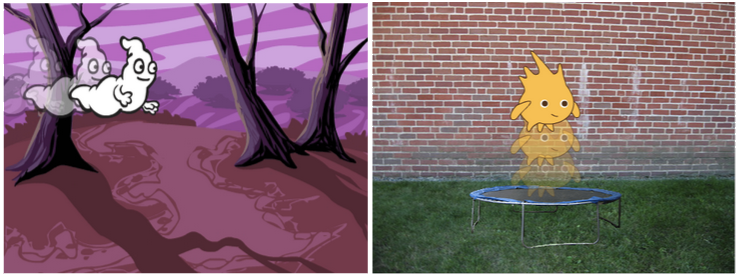

## சவால்: உங்கள் சொந்த அனிமேஷனை உருவாக்கவும்

உங்கள் விண்வெளி அனிமேஷனை நிறுத்தி, அதைச் சேமித்து, புதிய கீறல் திட்டத்தைத் தொடங்கவும்.

உங்கள் சொந்த அனிமேஷனை உருவாக்க இந்த திட்டத்தில் நீங்கள் கற்றுக்கொண்டதைப் பயன்படுத்தவும். இது நீங்கள் விரும்பும் எதையும் கொண்டிருக்கலாம், ஆனால் உங்கள் அனிமேஷனை நீங்கள் தேர்வுசெய்த பின்னணியுடன் பொருத்த முயற்சிக்கவும். இங்கே சில உதாரணங்கள்:

