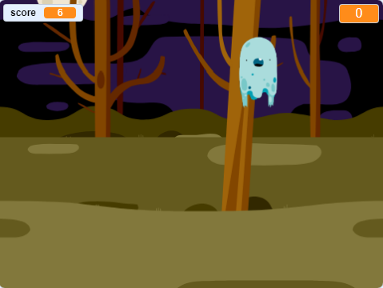

## அடுத்து என்ன?

[கோஸ்ட்பஸ்டர்ஸ்](https://projects.raspberrypi.org/en/projects/ghostbusters?utm_source=pathway&utm_medium=whatnext&utm_campaign=projects) திட்டத்தை முயற்சிக்கவும்! அந்த திட்டத்தில், எல்லா இடங்களிலும் தோன்றும் பேய்களுடன் ஒரு விளையாட்டை எவ்வாறு உருவாக்குவது என்பதையும் நீங்கள் பிடிக்க வேண்டும் என்பதையும் கற்றுக்கொள்வீர்கள். விளையாட்டிற்கு ஒரு டைமரையும் மதிப்பெண்ணையும் எவ்வாறு சேர்ப்பது என்பதையும் நீங்கள் கற்றுக் கொள்வீர்கள், இதன் மூலம் நீங்கள் எத்தனை பேய்களைப் பிடிக்க முடியும் என்பதைக் காணலாம்.

\--- no-print \---

  <iframe allowtransparency="true" width="485" height="402" src="https://scratch.mit.edu/projects/embed/276874679/?autostart=false" frameborder="0" scrolling="no"></iframe>
  

\--- /no-print \---

\--- print-only \---

\--- /print-only \---