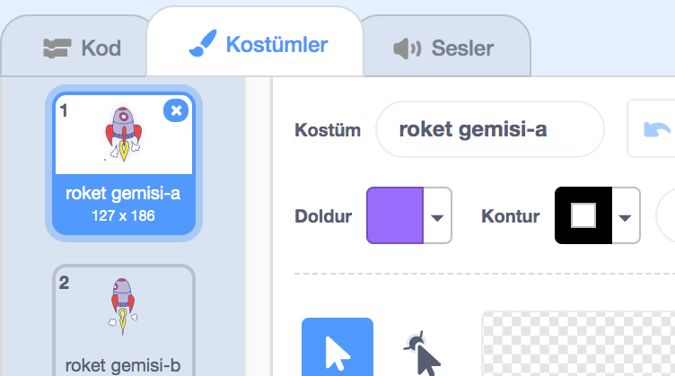
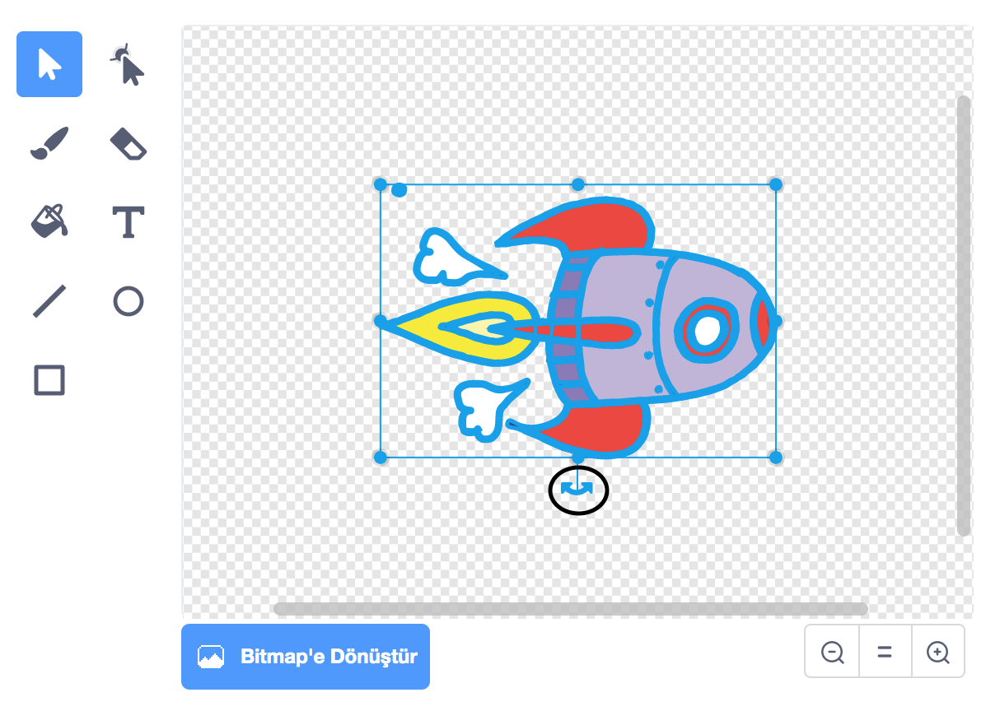

## Bir uzay gemisini canlandırma

İlk adımınız Dünya'ya doğru uçan bir uzay gemisi oluşturmak olacak!

\--- task \---

Yeni bir Scratch projesi açın.

**Çevrimiçi:** Çevrimiçi yeni bir Scratch projesi açmak için [rpf.io/scratch-new](http://rpf.io/scratchon){:target="_blank"} adresine gidin.

**Çevrimdışı:** Çevrimdışı düzenleyicide yeni bir proje açın.

Scratch çevrimdışı düzenleyicisini indirip yüklemeniz gerekirse, bunu [ rpf.io/scratchoff adresinde bulabilirsiniz. ](http://rpf.io/scratchoff) {: Hedef = "_ blank"}.

\--- /task \---

\--- task \---

Sahne Alanı'na 'roket' ve 'Dünya' kuklaları ekleyin.


[[[generic-scratch3-sprite-from-library]]]

\--- /task \---

\--- task \---

Sahne Alanı'na 'Yıldızlar' fonunu ekleyin.


\--- /task \---

\--- task \---

Uzay gemisi kuklasına tıklayın ve **Costumes** sekmesine tıklayın.



\--- /task \---

\--- task \---

**Ok** aracını kullanarak uzay gemisi görüntüsünün etrafındaki bir kutuyu tıklayıp sürükleyebilirsiniz. Sonra **dairesel döndürme**'ye tıklayın ve tutamacı yan tarafına gelene kadar döndürün.



\--- /görev \---

\--- task \---

Bu kodu uzay gemisi kuklanıza ekleyin:


```blocks3
when flag clicked
point in direction (0)
go to x:(-150) y:(-150)
say [Let's go] for (2) seconds
point towards (Earth v)
glide (1) secs to x:(0) y:(0)
```

Eklediğiniz kod bloklarındaki sayıları, kodun yukarıdakiyle tamamen aynı olması için değiştirin.

\--- /task \---

Yeşil bayrağa tıklarsanız, uzay gemisinin konuştuğunu, döndüğünü ve sahnenin ortasına doğru kaydığını göreceksiniz.

