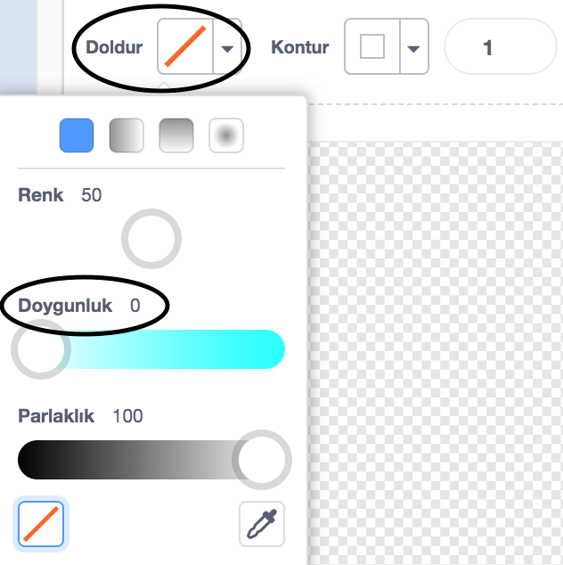
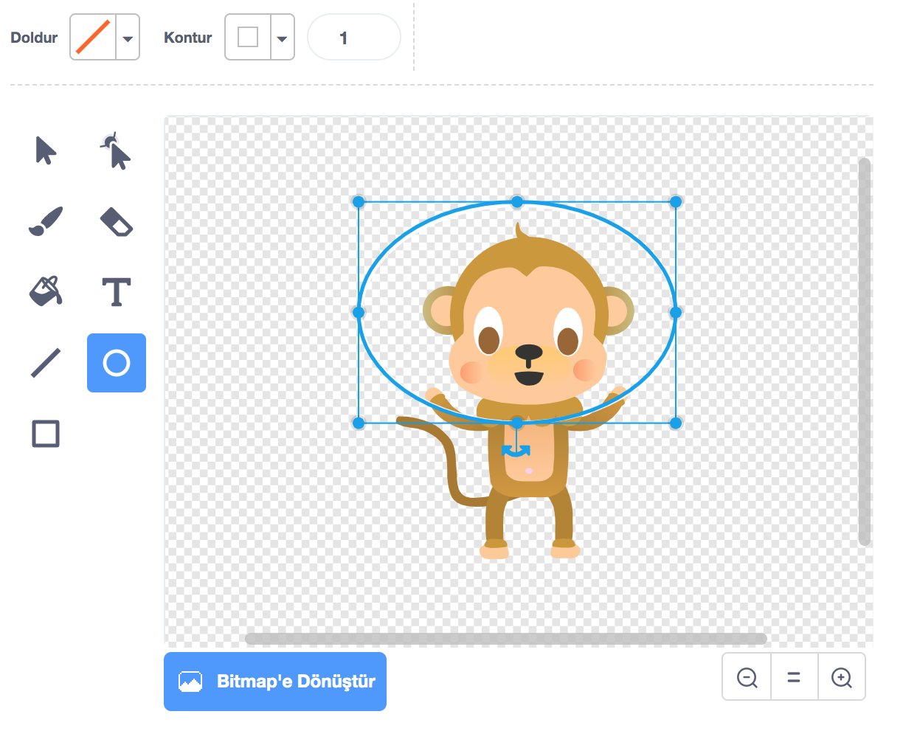

## Süzülen maymun

Şimdi animasyonunuza uzayda kaybolmuş bir maymun ekleyeceksiniz!

\--- task \---

Kütüphaneden 'maymun' kuklasını ekleyerek başlayın.


\--- /task \---

Yeni maymun kuklanıza tıklayın, ardından maymunun görünüşünü düzenleyebilmek için **Kostümler** seçeneğine tıklayın.

\--- task \---

Dolguyu kırmızı çizgiyi seçerek saydam olacak şekilde ayarlayın. Ana hat için, doygunluk değerini `0`'a getirerek beyaz renge ayarlayın.



\--- /task \---

\--- task \---

**Daire** aracına tıklayın ve maymunun kafasının etrafına beyaz bir uzay kaskı çizmek için kullanın.



\--- /task \---

\--- task \---

Maymun kuklanıza sonsuza dek bir daire içinde yavaşça dönmesi için bir kod ekleyebilir misiniz?

\--- hints \--- \--- hint \---

Yeşil **bayrak tıklandığında**, maymun kuklanız **sonsuza dek** bir daire içinde **dönmeli**.

\--- /hint \--- \--- hint \---

İhtiyacınız olan kod blokları:

```blocks3
forever
end

turn cw (15) degrees

when flag clicked
```

\--- /hint \--- \--- hint \---

İşte maymunun dönmesini sağlayacak kod:


```blocks3
when flag clicked
forever
    turn cw (1) degrees
```

\--- /hint \--- \--- /hints \---

\--- /task \---

Projenizi test edin ve kaydedin. Bu animasyon sonsuza kadar devam edeceğinden onu sonlandırmak için kırmızı **durdur** butonuna tıklamanız gerekecek!

