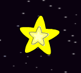

## Adım 5: parlayan yıldızı

Parıltıları parlayan bir yıldız yapmak için birleştirelim.

+ Animasyonunuza bir 'yıldız' sprite ekleyin.
    
    

+ Yıldızını tekrar tekrar büyümek ve küçültmek için kodlayabilir misin?
    
    

Yeşil \--- ipuçları \--- \--- ipucu \--- **bayrak tıklandığında**, yıldızını sprite gerekir **değişiklik boyutu** birkaç kat daha büyük olsun, sonra **değişiklik boyutu** küçük bir kaç kez olsun . O büyür, böylece bunu yapmak ve sonra küçülür gerektiğini **sonsuza**. \--- / ipucu \--- \--- ipucu \--- İhtiyacınız olacak kod blokları:  \--- / ipucu \--- \--- ipucu \--- İşte yıldız parlamasını yapmak için kod:  \--- / ipucu \--- \--- / ipuçları \---