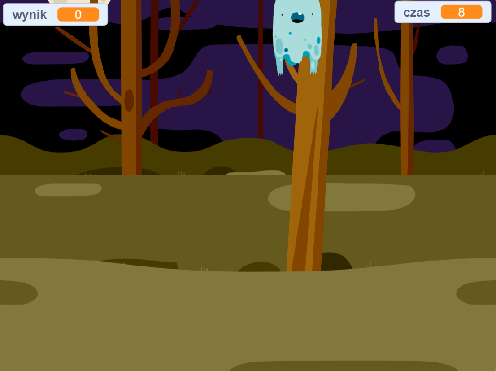

## Sırada ne var?

[Hayalet Avcıları](https://projects.raspberrypi.org/tr-TR/projects/ghostbusters?utm_source=pathway&utm_medium=whatnext&utm_campaign=projects) projesini dene! Bu projede, her tarafta ortaya çıkan hayaletlerin olduğu ve bunların yakalanması gerektiği bir oyun yapmayı öğreneceksiniz. Aynı zamanda bir zamanlayıcı ve oyun skoru eklemeyi öğreneceksiniz. Böylelikle kaç hayalet yakalayabildiğinizi göreceksiniz.

--- no-print ---

  <iframe allowtransparency="true" width="485" height="402" src="https://scratch.mit.edu/projects/embed/276874679/?autostart=false" frameborder="0" scrolling="no"></iframe>
  

--- /no-print ---

--- print-only ---

--- /print-only ---

Bu proje gönüllüler tarafından tercüme edildi:

**Meliha Ergincan**
**Emre Tanrıverdi**

Dünyanın dört bir yanındaki insanlara anadilinde öğrenme şansı verebildiğimiz için gönüllülere teşekkür ederiz. Daha fazla gönüllü tercümana ulaşmamızda bize yardımcı olabilirsiniz - rpf.io/translate adresinden daha fazla bilgiye ulaşabilirsiniz.