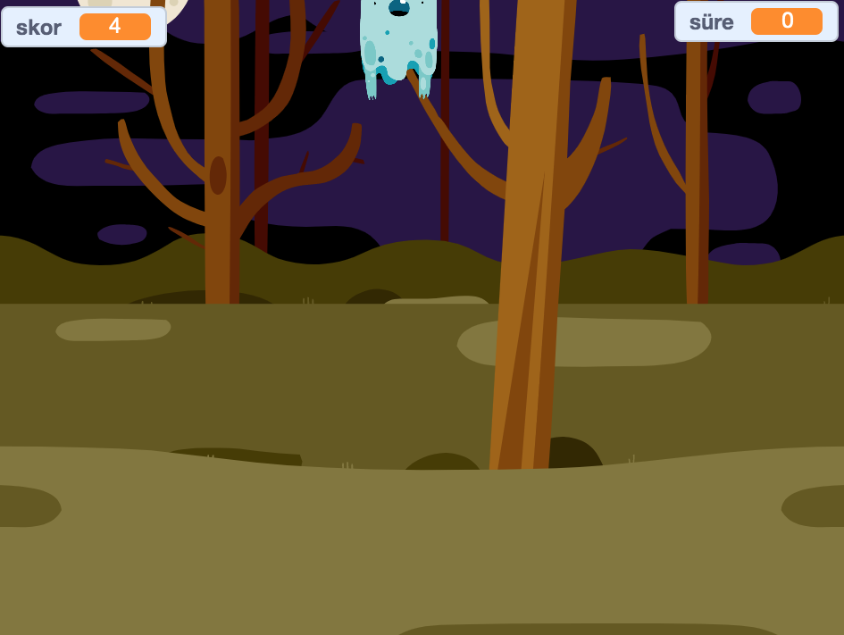

## Sırada ne var?

Try the [Ghostbusters](https://projects.raspberrypi.org/en/projects/ghostbusters?utm_source=pathway&utm_medium=whatnext&utm_campaign=projects) project! Bu projede, her yerde görünen ve yakalamanız gereken hayaletlerle bir oyun yaratmayı öğreneceksiniz. Oyuna bir zamanlayıcı ve puan eklemeyi de öğreneceksiniz. Böylece kaç hayalet yakalayabildiğinizi görebilirsiniz.

\--- no-print \---

  <iframe allowtransparency="true" width="485" height="402" src="https://scratch.mit.edu/projects/embed/276874679/?autostart=false" frameborder="0" scrolling="no"></iframe>
  

\--- /no-print \---

\--- print-only \---

\--- /print-only \---