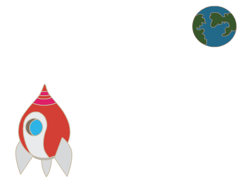
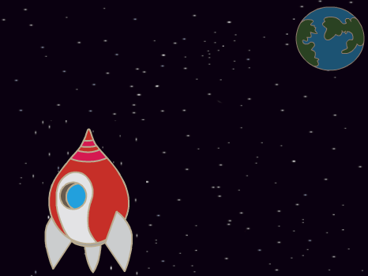
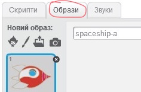
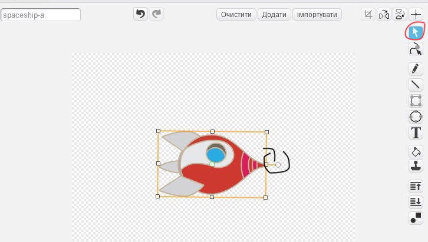

## Анімація космічного корабля

Your first step will be to create a spaceship that flies towards the Earth!

\--- task \---

Open a new Scratch project.

**Online:** open a new online Scratch project at [rpf.io/scratch-new](http://rpf.io/scratchon){:target="_blank"}.

**Offline:** open a new project in the offline editor.

If you need to download and install the Scratch offline editor, you can find it at [rpf.io/scratchoff](http://rpf.io/scratchoff){:target="_blank"}.

\--- /task \---

\--- task \--- Add 'rocketship' and 'Earth' sprites to your Stage.



[[[generic-scratch3-sprite-from-library]]]

\--- /task \---

\--- task \--- Add the 'Stars' backdrop to your Stage.



\--- /task \---

\--- task \--- Click on your spaceship sprite, and click on the **Costumes** tab.



\--- /task \---

\--- task \--- Use the **arrow** tool to click and drag a box around the whole spaceship image. Then click on the circular **rotate** handle, and rotate the image until it is on its side.



\--- /task \---

\--- task \--- Add this code to your spaceship sprite:


```blocks3
when flag clicked
point in direction (0)
go to x:(-150) y:(-150)
say [Let's go] for (2) seconds
point towards (Earth v)
glide (1) secs to x:(0) y:(0)
```

Change the numbers in the code blocks you've added so that the code is exactly the same as above.

\--- /task \---

При клацанні на зелений прапор, ви повинні побачити, що космічний корабель говорить, повертається і ковзає по відношенню до центру сцени.

