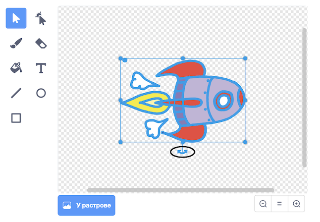

## Анімація космічного корабля

Твоїм першим кроком буде створення космічного корабля, що летить до Землі!

\--- task \---

Відкрий новий проєкт Скретч.

**Онлайн:** відкрий новий онлайн проєкт Скретч на [rpf.io/scratch-new](http://rpf.io/scratchon){:target="_blank"}.

**Офлайн:** відкрий новий проєкт в офлайн-редакторі.

Якщо тобі треба завантажити та встановити офлайн-редактор Скретч, то ти можеш його знайти на [rpf.io/scratchoff](http://rpf.io/scratchoff){:target="_blank"}.

\--- /task \---

\--- task \---

Add 'rocketship' and 'Earth' sprites to your Stage.


[[[generic-scratch3-sprite-from-library]]]

\--- /task \---

\--- task \---

Add the 'Stars' backdrop to your Stage.


\--- /task \---

\--- task \---

Click on your spaceship sprite, and click on the **Costumes** tab.


\--- /task \---

\--- task \---

Use the **arrow** tool to click and drag a box around the whole spaceship image. Then click on the circular **rotate** handle, and rotate the image until it is on its side.



\--- /task \---

\--- task \---

Add this code to your spaceship sprite:


```blocks3
коли ⚑ натиснуто
повернути в напрямку (0)
перемістити в x: (-150) y: (-150)
говорити [Поїхали!] (2) сек
слідувати за (Earth v)
ковзати (1) сек до x: (0) y: (0)
```

Change the numbers in the code blocks you've added so that the code is exactly the same as above.

\--- /task \---

If you click the green flag, you should see the spaceship speak, turn, and glide towards the centre of the stage.

