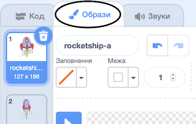

## Анімація космічного корабля

Твоїм першим кроком буде створення космічного корабля, що летить до Землі!

\--- task \---

Відкрий новий проєкт Скретч.

**Онлайн:** відкрий новий онлайн проєкт Скретч на [rpf.io/scratch-new](http://rpf.io/scratchon){:target="_blank"}.

**Офлайн:** відкрий новий проєкт в офлайн-редакторі.

Якщо тобі треба завантажити та встановити офлайн-редактор Скретч, то ти можеш його знайти на [rpf.io/scratchoff](http://rpf.io/scratchoff){:target="_blank"}.

\--- /task \---

\--- task \--- Додай спрайти "rocketship" (космічний корабель) та "Earth" (Земля) на Сцену.


[[[generic-scratch3-sprite-from-library]]]

\--- /task \---

\--- task \--- Додай фон "Stars" на Сцену.


\--- /task \---

\--- task \--- Натисни на спрайт космічного корабля, а далі перейди на вкладку **Образи**.



\--- /task \---

\--- task \--- Використовуй інструмент **стрілка** для того, щоб клікнути і розтягнути прямокутник навколо зображення цілого космічного корабля. Потім клікни на круглу ручку **повернути** і повертай зображення до тих пір, поки воно не опиниться на своєму боці.


\--- /task \---

\--- task \--- Додай наступний код до спрайту космічного корабля:


```blocks3
коли ⚑ натиснуто
повернути в напрямку (0)
перемістити в x: (-150) y: (-150)
говорити [Поїхали!] (2) сек
слідувати за (Earth v)
ковзати (1) сек до x: (0) y: (0)
```

Зміни числа в блоках з кодом так, щоб код був точно таким, як показано вище.

\--- /task \---

Якщо ти натиснеш на зелений прапор, то побачиш, як космічний корабель заговорить, поверне і почне ковзати в напрямку центру сцени.

