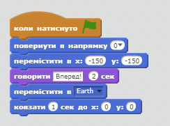

## Крок 1: Анімація космічного корабля

Давайте зробимо корабель, який летить до Землі!

+ Відкрийте новий порожній проект Scratch.

[[[generic-scratch-new-project]]]

+ Додайте спрайти "космічний корабель" і "Землю" у проект.
    
    

[[[generic-scratch-sprite-from-library]]]

+ Додайте фон "Зірки".
    
    

[[[generic-scratch-backdrop-from-library]]]

+ Натисніть на спрайт "космічний корабель" і натисніть вкладку **Образи**.
    
    

+ Використовуйте інструмент **"стрілка"** для вибору зображення. Потім натисніть круглий значок **обернути** та обертайте зображення, поки воно не буде на боці.
    
    

+ Додайте цей код у свій спрайт "космічний корабель":
    
    
    
    Змініть числа в кодових блоках так, щоб код був таким самим, як на зображенні вище.
    
    При клацанні на зелений прапор, ви повинні побачити, що космічний корабель говорить, повертається і ковзає по відношенню до центру сцени.
    
    

[[[generic-scratch-saving]]]

\--- challenge \---

## Завдання: вдоскональте свою анімацію

Чи можете ви змінити цифри в анімаційному коді так, щоб:

+ Космічний корабель рухався, поки він не торкнеться Землі?
+ Космічний корабель рухався до Землі повільніше?

Вам потрібно буде змінити номери в цьому блоці:

[[[generic-scratch-coordinates]]]

\--- /challenge \---