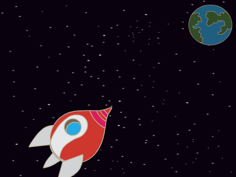
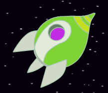
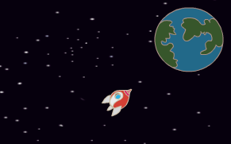

## Анімація за допомогою циклів

Зробити анімацію руху космічного корабля можна й по-іншому: наказавши йому рухатися малими відрізками багато разів

--- task ---

Видали із свого коду блок `ковзати`{:class="block3motion"}. Щоб це зробити, перетягни його із вкладки Код назад до інших одиночних блоків.


```blocks3
when flag clicked
point in direction (0)
go to x:(-150) y:(-150)
say [Поїхали!] for (2) seconds
point towards (Earth v)

- glide (1) secs to x:(0) y:(0)
```

--- /task ---

--- task ---

Тепер використай блок `повторити`{:class="block3control"}, щоб перемістити космічний корабель до Землі.




```blocks3
when flag clicked
point in direction (0)
go to x:(-150) y:(-150)
say [Поїхали!] for (2) seconds
point towards (Earth v)

+ repeat (200)
    move (2) steps
```

Перевір та збережи свій код. Твій космічний корабель повинен рухатися в напрямку Землі так само, як раніше, але на цей раз за допомогою блоку `повторити`.

--- /task ---

--- task ---

Далі додай код до спрайту космічного корабля, щоб він міняв колір, рухаючись до Землі.

Використовуй цей блок:


```blocks3
when flag clicked
point in direction (0)
go to x:(-150) y:(-150)
say [Поїхали!] for (2) seconds
point towards (Earth v)
repeat (200)
    move (2) steps

+    change [color v] effect by (25)
```

Протестуй та збережи свій код.



--- /task ---

--- task ---

Чи можеш ти зробити так, щоб космічний корабель зменшувався при русі до Землі?

--- hints ---

--- hint ---

Спочатку твій космічний корабель повинен мати `розмір 100`{:class="blocklooks"}, а далі `змінюй розмір`{:class="blocklooks"} на невелике значення кожного разу, коли він переміщується.

--- /hint ---

--- hint ---

Тобі треба буде додати наступні блоки до свого коду:


```blocks3
change size by (10)

set size to (100) %
```

--- /hint ---

--- hint ---

Твій код повинен виглядати так:


```blocks3
when flag clicked

+ set size to (100) %
point in direction (0)
go to x:(-150) y:(-150)
say [Поїхали!] for (2) seconds
point towards (Earth v)
repeat (200)
    move (2) steps
    change [color v] effect by (25)
+   change size by (-0.3)
```

--- /hint ---

--- /hints ---

--- /task ---

Перевір та збережи свій код. Тепер твій космічний корабель має зменшуватися при русі. Перевір свій космічний корабель **іще раз**. Чи правильний у нього розмір на початку?

