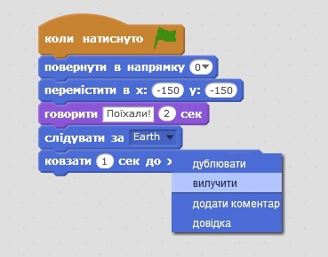
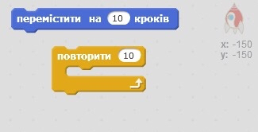
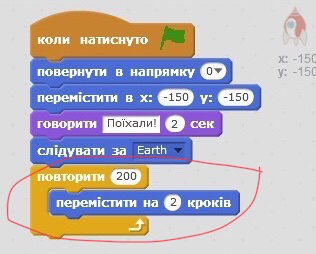
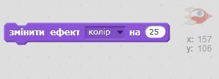
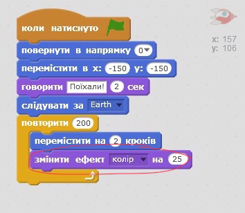
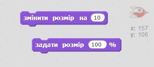
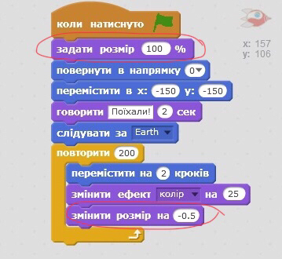

## Крок 2. Анімація з використанням циклів

Зробити анімацію руху космічного корабля можна й по-іншому: накажіть йому рухатися малими відрізками багато разів.

+ Видалити блок `ковзати` з вашого коду правою кнопкою миші та виберіть пункт **Видалити**. Ви також можете видалити код, перетягнувши його з області "Сценарій" і повернувшись у область блоків коду.
    
    

+ Чи можете ви використати блок `повторити`, щоб ваш космічний корабель рухався до Землі?
    
    Перевірте і збережіть: ваш космічний корабель повинен рухатися в напрямку Землі точно так, як раніше, але на цей раз, використовуємо блок `повторити`.
    
    

\--- hints \--- \--- hint \---замість **ковзати** ваш космічний корабель повинен **повторно** **рухатися** на декілька кроків за один раз. \--- /hint \--- \--- hint \--- Ось код блоків, що вам знадобляться:  \--- /hint \--- \--- hint \--- Ось код для анімації космічного корабеля:  (ви можете використовувати різні номери в блоках `повторити` і `переміщати`, поки корабель не дістанеться Землі!) \--- /hints \--- \--- /hints \---

+ Чи можете ви запрограмувати свій космічний корабель на зміну кольору під час його руху до Землі?
    
    Перевірте та збережіть.
    
    

\--- hints \--- \--- hint \--- Ваш космічний корабель повинен **змінити колір** в русі. \--- /hint \--- \--- hint \--- Ось додатковий блок кодів, який вам знадобиться:  \--- /hint \--- \--- hint \--- Ось код, що змінює колір космічного корабля:  \--- /hint \--- \--- /hints \---

+ Ви можете зробити свій космічний корабель меншим, коли він потрапляє на Землю?
    
    Перевірте та збережіть. Ваш корабель повинен зменшуватися, під час руху. Перевірте свій космічний корабель ** другий раз **. Він правильного розміру на початку?
    
    

\--- hints \--- \--- hint \--- Ваш космічний корабель повинен мати **100% розмір** розмір на початку, а потім потрохи **зменшуватися** під час його переміщення. \--- /hint \--- \--- hint \--- Ось код блоків, вам знадобиться:  \--- /hint \--- \--- hint \--- Ось код для зміни розміру вашого космічного корабля під час переміщення:  \---/hint\--- \---/hints\---