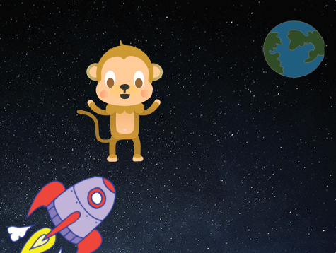
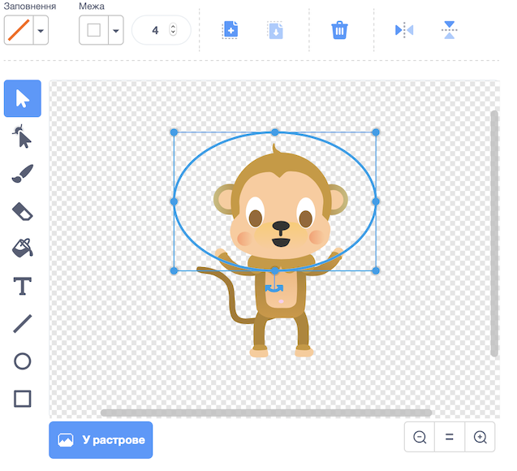
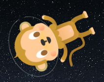

## Невагома мавпа

А тепер ти додаси до своєї анімації мавпу, що загубилася в космосі!

\--- task \---

Спочатку додай спрайт monkey («мавпа») з бібліотеки.



\--- /task \---

Натисни на щойно доданий спрайт мавпи, а далі перейди на вкладку **Образи** для того, щоб змінити її вигляд.

\--- task \---

Встанови прозоре заповнення, вибравши червону лінію. Для контуру вибери білий колір, пересунувши повзунок «Насиченість» на `0`.


\--- /task \---

\--- task \---

Вибери інструмент **коло**, щоб намалювати білий космічний шолом навколо голови мавпочки.



\--- /task \---

\--- task \---

Чи можеш ти додати код до спрайту мавпи так, щоб вона повільно оберталася без зупинки?

\--- hints \--- \--- hint \---

Коли зелений **прапорець натиснуто**, твій спрайт мавпи повинен здійснювати **поворот** по колу **завжди**.

\--- /hint \--- \--- hint \---

Тобі будуть потрібні наступні блоки коду:

```blocks3
forever
end

turn cw (15) degrees

when flag clicked
```

\--- /hint \--- \--- hint \---

Ось цей код змусить мавпочку обертатися:


```blocks3
when flag clicked
forever
    turn cw (1) degrees
```

\--- /hint \--- \--- /hints \---

\--- /task \---

Перевір та збережи свій проєкт. Натисни на червону кнопку **зупинити** для завершення анімації, бо інакше вона виконуватиметься вічно!

