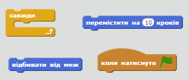
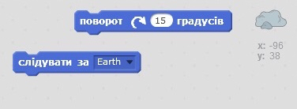
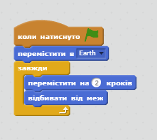

## Bouncing asteroid

Додамо астероїд, що плаває у просторі, до вашої анімації.

+ Додайте спрайт "астероїд" до вашої анімації.
    
    

+ Чи можете ви запрограмувати свій спрайт "астероїд" так, щоб той стрибав навколо сцени?
    
    

\--- hints \--- \--- hint \--- Коли на зелений **прапор натиснуто**, спрайт астероїда повинен **рухатися** і **стрибати** по сцені **без перестанку**. \--- /hint \--- \--- hint \--- Ось код блоків, які вам знадобляться:  Ви також можете встановити цікавішу відправну точку для астероїда за допомогою одного з цих блоків:  \--- /hint \--- \--- hint \--- Ось код, що допоможе рухати астероїд навколо сцени:  \--- /hint \--- \--- /hints \---