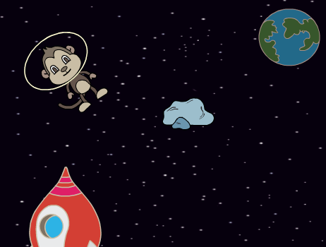
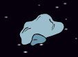

## Астероїд, що відбивається

Тепер ти додаси до своєї анімації летючий астероїд.

--- task ---

Додай спрайт rock («камінь») до своєї анімації.



--- /task ---

--- task ---

Чи можеш ти додати код, щоб твій астероїд літав по сцені й відбивався від її країв?



--- hints ---
--- hint ---

Коли на зелений **прапор натиснуто**, спрайт астероїда повинен **рухатися** по сцені і **відбиватися** **завжди**.

--- /hint ---
--- hint ---

Тобі будуть потрібні наступні блоки коду:

```blocks3
move (10) steps

if on edge bounce

when flag clicked

forever
```

Також ти можеш задати цікавіший початковий напрямок для астероїда за допомогою одного з цих блоків:

```blocks3
turn cw (15) degrees

point towards (Earth v)
```

--- /hint ---
--- hint ---

Наступний код змусить астероїд літати по сцені, відбиваючися від її країв:


```blocks3
when flag clicked
point towards (Earth v)
forever
    move (2) steps
    if on edge, bounce
```

--- /hint ---
--- /hints ---
--- /task ---