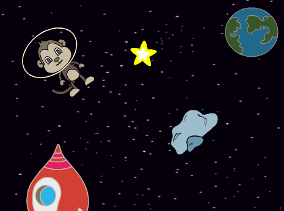

## Сяйна зірка

Тепер ти скомбінуєш цикли, щоб зробити сяючу зірку.

--- task ---

Додай спрайт star («зірка») до своєї сцени.



--- /task ---

--- task ---

Чи можеш ти додати код до спрайту зірки, щоб вона постійно збільшувалася та зменшувалася?


--- hints ---
--- hint ---

Коли на зелений **прапор натиснуто**, спрайт зірки має декілька разів **збільшитися**, а потім — декілька разів **зменшитися**. Він повинен збільшуватися та зменшуватися **завжди**, щоб здавалося, ніби він сяє.

--- /hint ---
--- hint ---

Тобі будуть потрібні наступні блоки коду:

```blocks3
repeat (10)
end

when flag clicked

repeat (10)
end

change size by (10)

change size by (10)

forever
```

--- /hint ---
--- hint ---

Ось код для збільшення та зменшення зірки:


```blocks3
when flag clicked
forever
    repeat (20)
        change size by (2)
    end
    repeat (20)
        change size by (-2)
    end

```

--- /hint ---
--- /hints ---
--- /task ---