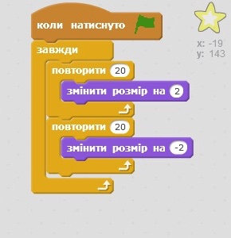

## Shining star

Об'єднаємо цикли, щоб зробити сяючу зірку.

+ Додайте спрайт "зірка" до вашої анімації.
    
    

+ Чи можете ви запрограмувати свою зірку так, щоб вона постійно то зростала, то зменшувалася?
    
    

\--- hints \--- \--- hint \---коли на зелений **прапор натиснуто**, спрайт зірки має **збільшитися** у кілька разів, а потім - **зменшитися** у кілька разів. Це має виглядати так, що зірка збільшується і зменшується **постійно**. \--- /hint \--- \--- hint \--- Ось код блоків, які вам знадобляться:  \--- /hint \--- \--- hint \--- Ось код, що допоможе вашій зірці світитися:  \---/hint\--- \---/hints\---