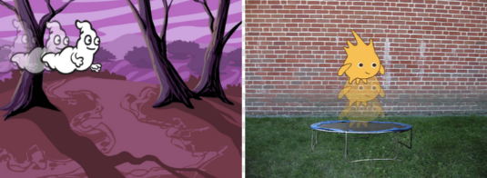

## Завдання: створи власну анімацію

Зупини космічну анімацію, збережи її та створи новий проєкт Скретч.

Використовуй те, про що ти дізнався в цьому проєкті, щоб створити власну анімацію. Це може бути що завгодно, але спробуй зробити так, щоб вона відповідала фону. Ось кілька прикладів:

