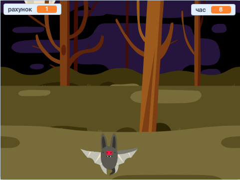

## Що далі?

Спробуй проєкт [Мисливці за привидами](https://projects.raspberrypi.org/uk-UA/projects/ghostbusters?utm_source=pathway&utm_medium=whatnext&utm_campaign=projects)! У цьому проєкті ти дізнаєшся, як створити гру з привидами, що з’являються звідусіль і яких треба ловити. Також ти дізнаєшся як додати таймер та рахунок до гри, щоб бачити, скільки привидів тобі вдалося зловити.

--- no-print ---

  <iframe allowtransparency="true" width="485" height="402" src="https://scratch.mit.edu/projects/embed/951081508/?autostart=false" frameborder="0" scrolling="no"></iframe>
  

--- /no-print ---

--- print-only ---

--- /print-only ---