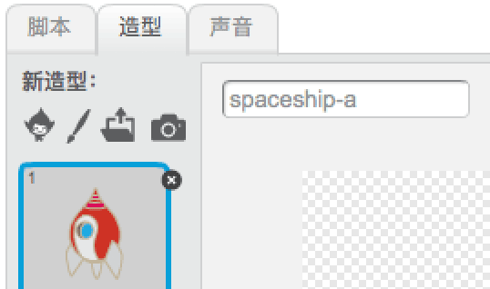
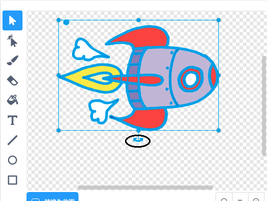
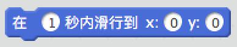

## 动画飞船

让我们建造一艘飞船飞向地球吧！

+ 打开一个空白Scratch工程。

[[[generic-scratch-new-project]]]

+ 向舞台中添加“飞船”和“地球”两个角色。
    
    

[[[generic-scratch-sprite-from-library]]]

+ 为舞台添加“星星“背景。
    
    

[[[generic-scratch-backdrop-from-library]]]

+ 点击飞船角色，然后点击**造型**选项卡。
    
    

+ 用**箭头**工具选中图片。然后点击圆形**旋转**把手，旋转图片将图片旋转90度。
    
    

+ 为飞船角色添加如下代码：
    
    
    
    修改代码块中的数字，让它与上面的图片一致。
    
    点击绿旗，你应该会看到飞船说话，转向，然后驶向舞台中央。
    
    

[[[generic-scratch-saving]]]

--- challenge ---

## 挑战：改进你的动画

你能修改动画代码实现如下功能吗：

+ 飞船碰到地球时停止移动
+ 飞船更缓慢地驶向地球

你需要修改如下代码块里的数值：

[[[generic-scratch-coordinates]]]

--- /challenge ---