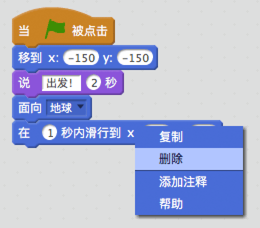
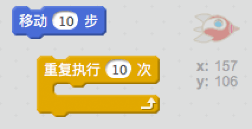
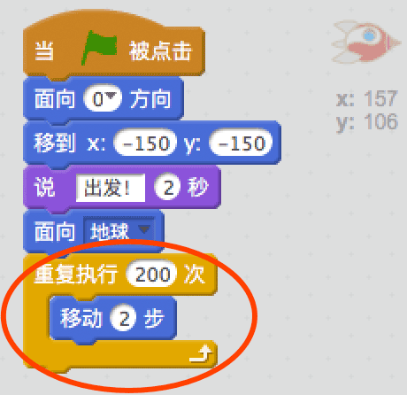
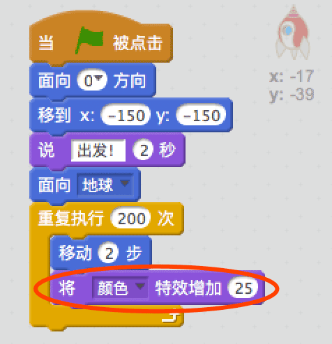
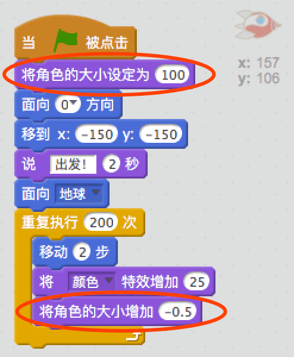

## 使用循环动画

另一种移动飞船的方式是重复多次每次移动一小步。

+ 右键点击`滑行`代码块然后点击删除，从代码中删除滑行代码块。 你也可以将代码从脚本区拖到代码块区来删除它。
    
    

+ 你能用`重复执行`代码块来让飞船驶向地球吗？
    
    测试并保存：飞船应该像之前一样驶向地球，只不过这次使用的是`重复执行`代码块。
    
    

--- hints --- --- hint --- 不同于滑行，这次飞船应该重复地每次移动几步。 --- /hint --- --- hint --- 这是你需要用到的代码块：  --- /hint --- --- hint --- 这是移动飞船的代码：  （你可以在`重复执行`和`移动`代码块中使用不同的数值，只要飞船依然能够抵达地球就行！） --- /hint --- --- /hints ---

+ 你能编码让飞船驶向地球的同时变换颜色吗？
    
    测试并保存。
    
    

--- hints --- --- hint --- 你的飞船应该在移动时改变颜色。 --- /hint --- --- hint --- 这是你需要的额外的代码块：  --- /hint --- --- hint --- 这是改变飞船颜色的代码：  --- /hint --- --- /hints ---

+ 您能让你的飞船在驶向地球的过程中逐渐变小吗？
    
    测试并保存。你的飞船在移动过程中应该逐渐变小。**再次**测试你的飞船，它的起始大小正确吗？
    
    

--- hints --- --- hint --- 飞船起始时应该是100%尺寸，然后在移动时慢慢改变大小。 --- /hint --- --- hint --- 这是你需要用到的代码块：  --- /hint --- --- hint --- 这是在飞船移动时改变飞船大小的代码：  --- /hint --- --- /hints ---