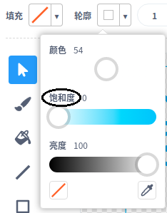

## 漂浮的猴子

让我们向动画中加入一只迷失在太空中的猴子！

首先从素材库中添加“猴子”角色。


\--- /task \---

点击新加入的猴子然后点击**造型**，你就可以编辑猴子的外观了。

\--- task \--- 通过选择红线将填充设置为透明。对于轮廓，通过将“饱和度”滑块移动到` 0来设置白色` 。

 \--- /task \---

点击**椭圆**工具在猴子头上画一顶白色的太空帽。


\--- /task \---

\--- task \--- 你能编码让猴子不停地缓慢旋转吗？

\---提示\--- \---提示\---

单击绿色**标志时** ，你的猴子精灵应该**转**永远在一个圆圈** ** 。

\--- /提示\--- \---提示\---

以下是你需要的代码块：

```blocks3
forever
end

turn cw (15) degrees

when flag clicked
```

\--- /提示\--- \---提示\---

这是让你的猴子旋转的代码：


```blocks3
when flag clicked
forever
    turn cw (1) degrees
```

\--- /hint \--- \--- /hints \---

\--- /task \---

测试并保存工程。你需要点击红色**停止**按钮来结束动画，否则它会一直动下去！

