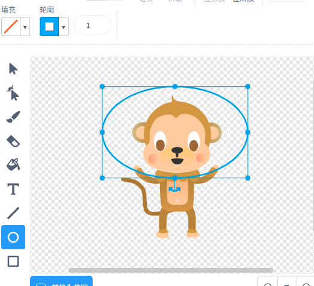
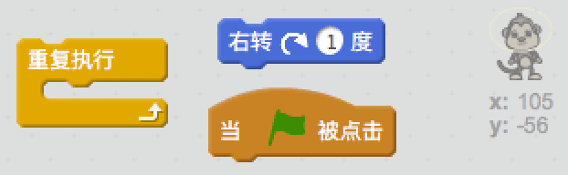
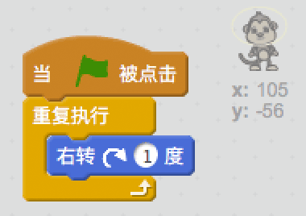

## 漂浮的猴子

让我们向动画中加入一只迷失在太空中的猴子！

+ 首先从素材库中添加“猴子”角色。
    
    

+ 点击新加入的猴子然后点击造型，你就可以编辑猴子的外观了。 点击椭圆工具在猴子头上画一顶白色的太空帽。
    
    

+ 你能编码让猴子不停地缓慢旋转吗？
    
    测试并保存工程。你需要点击红色停止按钮来结束动画，否则它会一直动下去！
    
    

--- hints --- --- hint --- 当绿旗被点击时，猴子应该不停地转圈。 --- /hint --- --- hint --- 这是你需要用到的代码块：  --- /hint --- --- hint --- 这是让猴子旋转的代码：  --- /hint --- --- /hints ---