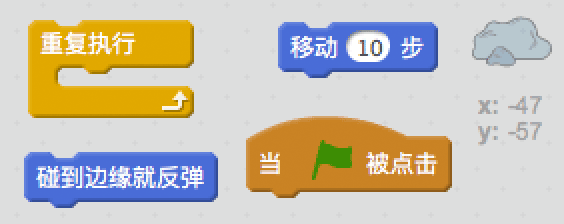
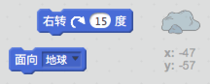
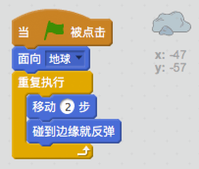

## 跳跃的小行星

让我们向动画中加入一些漂浮的太空岩石。

+ 向动画中加入“岩石”角色。
    
    

+ 你能编码让岩石在舞台上弹跳吗？
    
    

--- hints --- --- hint --- 当绿旗被点击时，岩石应该不停地在舞台上移动并反弹。 --- /hint --- --- hint --- 这是你需要用到的代码块：  你也可以用下面的代码块为岩石设置更多有趣的起始方向。  --- /hint --- --- hint --- 这是让岩石在舞台上反弹的代码：  --- /hint --- --- /hints ---