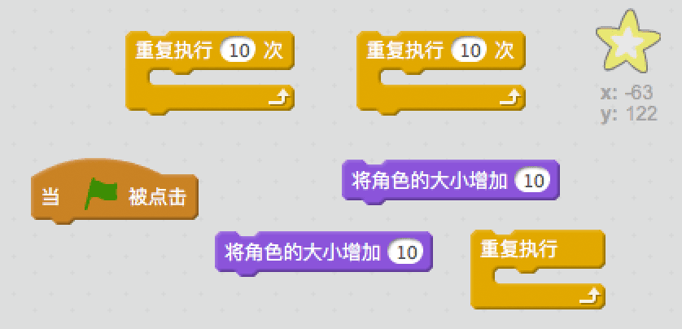
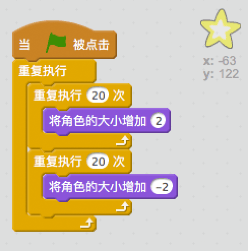

## 亮闪闪的星星

让我们把循环组合起来，来创造一颗闪亮的星星。

+ 向动画中添加“星星”角色。
    
    

+ 你能编码让星星不停地放大缩小吗？
    
    

--- hints --- --- hint --- 当绿旗被点击时，星星应该放大一段时间，然后缩小一段时间。 如此不停地放大然后缩小。 --- /hint --- --- hint --- 这是你需要用到的代码块：  --- /hint --- --- hint --- 这是让星星闪耀的代码：  --- /hint --- --- /hints ---