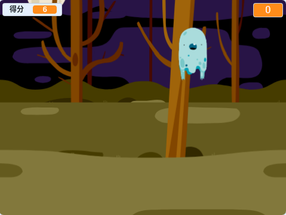

## 接下来呢？

试试[捉鬼敢死队](https://projects.raspberrypi.org/zh-CN/projects/ghostbusters?utm_source=pathway&utm_medium=whatnext&utm_campaign=projects)项目！ 在该项目中，您将学习如何创建一个鬼的游戏，这些鬼出现在整个地方并且需要您捕获。 您还将学习如何为游戏添加计时器和分数，以便您可以看到有多少鬼可以捕获。

--- no-print ---

  <iframe allowtransparency="true" width="485" height="402" src="https://scratch.mit.edu/projects/embed/276874679/?autostart=false" frameborder="0" scrolling="no"></iframe>
  

--- /no-print---

--- print-only ---

--- /print-only ---