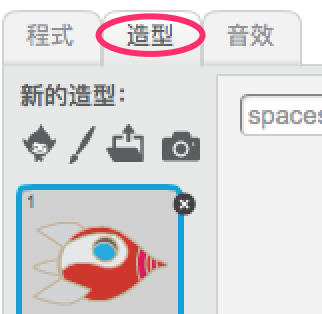
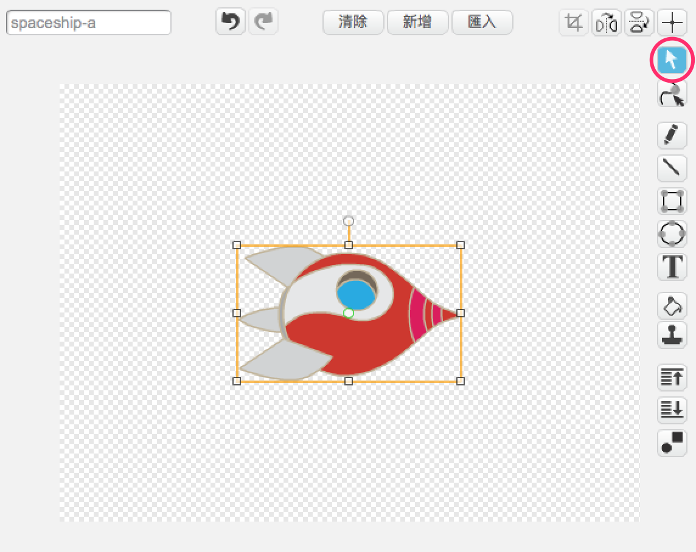

## 動起來的太空船

你的第一步是創建一個飛往地球的宇宙飛船！

--- task ---

建立一個新的 Scratch 專案。

**線上版：**你可以連結 [rpf.io/scratch-new](http://rpf.io/scratchon){:target="_blank"} 以新建專案。

**離線版：**在離線編輯器的工作列中開啟選單並點擊新建專案。。

如果你需要 Scratch 離線版編輯器，可以連結到 [rpf.io/scratchoff](http://rpf.io/scratchoff){:target="_blank"}。

--- /task ---

--- task ---

將 rocketship（太空船）和 Earth（地球）角色添加到舞台。


[[[generic-scratch3-sprite-from-library]]]

--- /task ---

--- task ---

為舞台添加一個新的背景 Stars（星空）。


--- /task ---

--- task ---

點擊太空船這個角色，然後切換到**造型**頁籤。



--- /task ---

--- task ---

使用**選取**工具選取圖像，然後在太空船圖像周圍會出現方框，用滑鼠左鍵按住弧形的**旋轉**控制點，然後朝你想要的方向旋轉，確定好後鬆開滑鼠左鍵。



--- /task ---

--- task ---

為你的太空船角色編寫這個程式：


```blocks3
當 @greenflag 被點擊
面朝 (0) 度
定位到 x:(-150) y:(-150)
說出 [Let's go] 持續 (2) 秒
面朝 (Earth v) 向
滑行 (1) 秒到 x:(0) y:(0)
```

記得要把程式積木中的數字改成和上面一樣。

--- /task ---

如果你點擊綠旗，你會看到太空船說話、轉向，然後滑到舞台中央。

