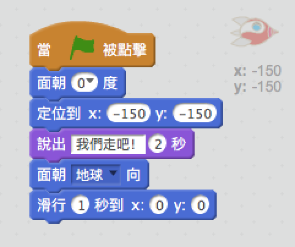
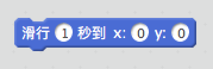

## Animating a spaceship

讓我們製作一艘飛向地球的太空船吧！

+ 打開一個新的Scratch項目。

[[[generic-scratch-new-project]]]

+ 將“太空船”和“地球”角色加入你的舞台。
    
    

[[[generic-scratch-sprite-from-library]]]

+ 將“星星”添加到舞台的背景。
    
    

[[[generic-scratch-backdrop-from-library]]]

+ 點擊你的太空船角色，然後點擊 **造型** 標籤。
    
    

+ 使用 **箭頭** 工具選擇圖像。然後點擊圓形 **旋轉** 手柄，然後旋轉圖像直到其位於其側面。
    
    

+ 將此代碼添加到您的太空船角色中：
    
    
    
    更改代碼塊中的數字，以便代碼與上圖中的數字完全相同。
    
    如果你點擊綠旗，你將看到太空船說話，轉身，然後滑向舞台中央。
    
    

[[[generic-scratch-saving]]]

\--- challenge \---

## 挑戰：改進你的動畫

你可以更改動畫代碼中的數字，以便：

+ 太空船運行直到觸及地球？
+ 太空船向著地球更慢運行？

您需要更改此區塊中的數字：

[[[generic-scratch-coordinates]]]

\--- /challenge \---