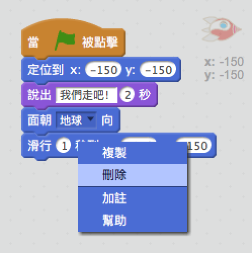
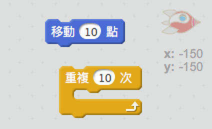
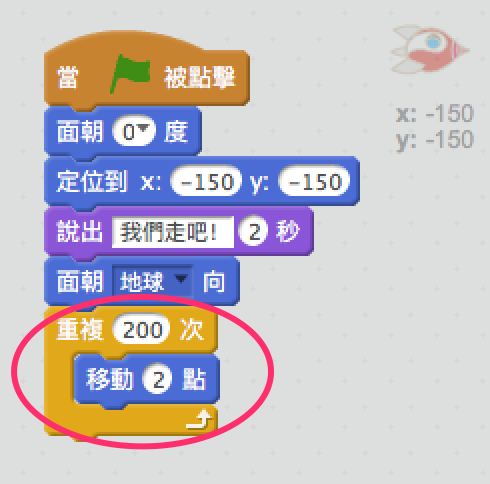
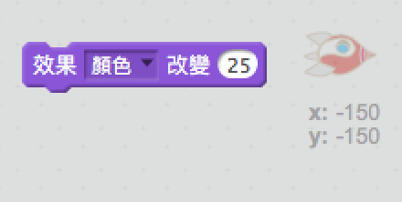
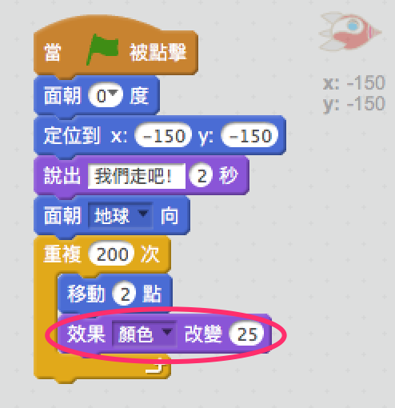
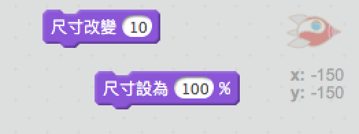
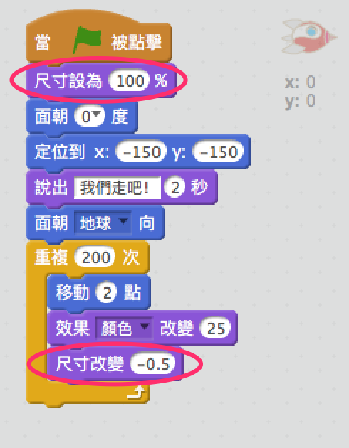

## 步驟2：使用循環動畫

另一種能讓太空船活躍的方法是讓它運行短距離多次。

+ 刪除 `滑行` 塊，請點擊右鍵然後再點擊 **刪除**。 您也可以通過將其代碼從腳本區拖回到代碼塊區來刪除代碼。
    
    

+ 您能否使用 `重複` 塊將你的太空船運行到地球？
    
    測試並保存：這次使用 `重複` 模塊，您的太空船應該像之前一樣朝著地球運行。
    
    

\--- hints \--- \--- hint \--- 以其 **滑行**，您的太空船因該每一次都 **重複** **運行** 幾步。 \--- /hint \--- \--- hint \--- 以下是您需要的代碼塊：  \--- /hint \--- \--- hint \--- 以下是讓您的太空船動畫的代碼：  (您可以在 `重複` 和 `移動` 塊中使用不同的數字，只要太空船仍然可以到達地球！) \--- /hint \--- \--- /hints \---

+ 您能編碼你的太空船在向地球運行時改變顏色嗎？
    
    測試與保存。
    
    

\--- hints \--- \--- hint \--- 您的太空船在運行時應該**改變顏色**。 \--- /hint \--- \--- hint \--- 以下是您需要的額外代碼塊：  \--- /hint \--- \--- hint \--- 以下是來改變您的太空船顏色的代碼：  \--- /hint \--- \--- /hints \---

+ 您能讓太空船向地球運行的時候變得越來越小嗎？
    
    測試與保存。您的太空船應運行時變得越小。再測試你的太空船 **第二次**。它的尺寸比啟動時是否不同？
    
    

\--- hints \--- \--- hint \--- 您的太空船應該從 **100％尺寸**開始，然後運行時有稍微的 **尺寸更改**。 \--- /hint \--- \--- hint \--- 以下是您需要的代碼塊：  \--- /hint \--- \--- hint \--- 以下是來改變您的運行中太空船大小的代碼：  \--- /hint \--- \--- /hints \---