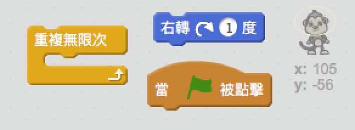
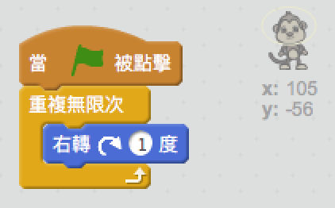

## Floating monkey

讓我們在您的太空中的動畫添加一隻迷路的猴子！

+ 首先添加庫中的'猴子'角色。
    
    

+ 如果您點擊新的猴子角色，然後點擊 **造型**，您可以編輯猴子的外觀。 點擊 **橢圓** 工具，然後在猴子的頭部周圍繪製一個白色太空頭盔。
    
    

+ 您能編碼讓猴子角色慢慢地在一個圈內旋轉嗎？
    
    測試與保存您的項目。你一定要點擊紅色的 **停止** 按鈕來結束這個動畫。要不然它會一直持續下去！
    
    

\--- hints \--- \--- hint \--- 當**綠旗**被點擊時，你的猴子角色應該將 **永遠** 在一個圓圈 **轉圈**。 \--- /hint \--- \--- hint \--- 以下是您需要的代碼塊：  \--- /hint \--- \--- hint \--- 以下是讓您的猴子旋轉的代碼：  \--- /hint \--- \--- /hints \---