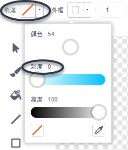
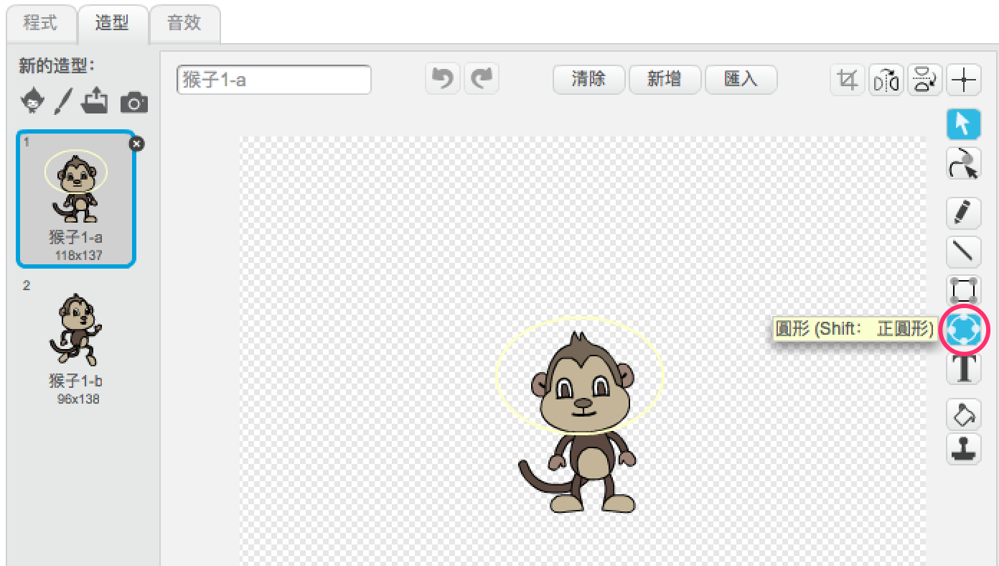

## 漂浮的猴子

現在我們加隻在太空中迷路的猴子吧！

--- task ---

從範例庫中添加一個名為 monkey 的角色。


--- /task ---

在新的猴子角色上點一下然後切換到**造型**頁籤，我們來修改猴子的外觀。

--- task ---

把顏色填滿設定為透明（紅線圖示） ，外框部分則是移動彩度滑桿到 `0`，讓它變成白色。



--- /task ---

--- task ---

點擊**圓形**工具，在猴子頭上畫出一個白色輪廓的太空頭盔。



--- /task ---

--- task ---

你能添加一些程式，讓猴子不停在空中打轉嗎？

--- hints --- --- hint ---

當**綠旗被點擊**時，你的猴子角色應該**轉**個圈，然後**重複無限次**。

--- /hint --- --- hint ---

這裡是你需要的程式積木：

```blocks3
重複無限次
end

右轉 @turnright (15) 度

當 @greenflag 被點擊
```

--- /hint --- --- hint ---

這個是讓猴子打轉的程式：


```blocks3
當 @greenflag 被點擊
重複無限次
    右轉 @turnright (1) 度
end
```

--- /hint --- --- /hints ---

--- /task ---

測試並儲存你的專案，記得要點擊紅色的**停止**圖示結束運作，不然你的猴子會轉個不停。

