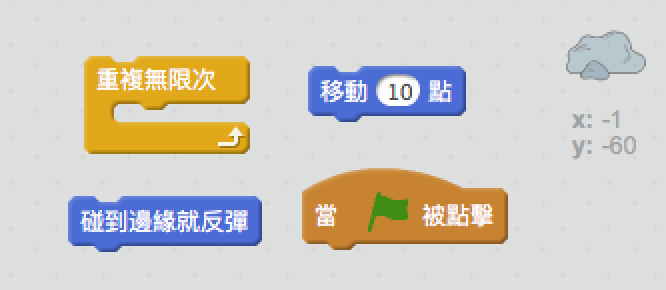
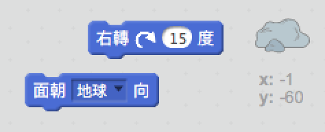
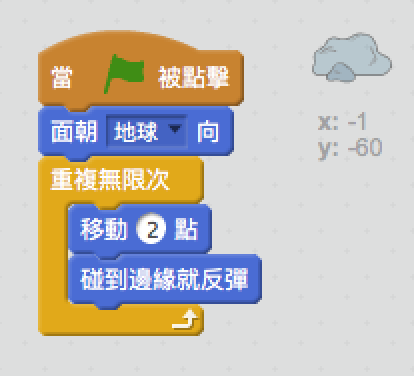

## Bouncing asteroid

讓我們在您的太空動畫添加一些浮動的太空岩石。

+ 添加”岩石“角色到動畫中。
    
    

+ 您能編碼你的岩石角色在舞台上跳躍嗎？
    
    

\--- hints \--- \--- hint \--- 當 **綠旗**被點擊時，您的岩石角色應該會在舞台中 **永遠** **移動** 和 **飄動**。 \--- /hint \--- \--- hint \--- 以下是您需要的代碼塊：  您也可以用以下的代碼塊其中之一來給岩石設置一個更有趣的開始方向：  \--- /hint \--- \--- hint \--- 以下是讓舞台上彈跳岩石的代碼：  \--- /hint \--- \--- /hints \---