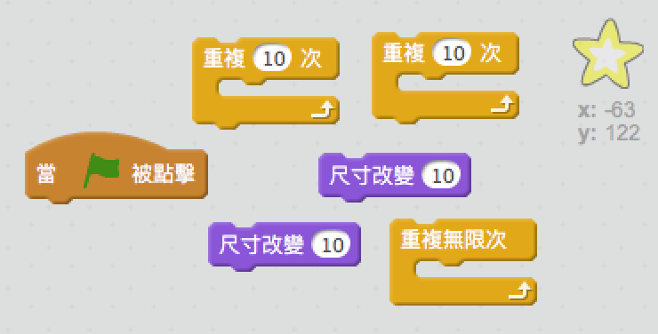
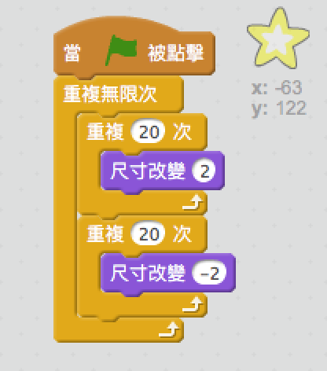

## Shining star

讓我們結合循環來創造一顆閃亮的星星。

+ 將“星星”角色添加到您的動畫中。
    
    

+ 你可以編碼您的星星反復成長和縮小嗎？
    
    

\--- hints \--- \--- hint \--- 當 **綠旗**被點擊時，你的星星角色應該會 **改變尺寸** 變大幾次，然後再**改變尺寸** 變小幾次。 它應該這樣做，以便它增長，然後 **永遠** 縮小。 \--- /hint \--- \--- hint \--- 以下是您需要的代碼塊：  \--- /hint \--- \--- hint \--- 以下是讓您的星星閃耀的代碼：  \--- /hint \--- \--- /hints \---