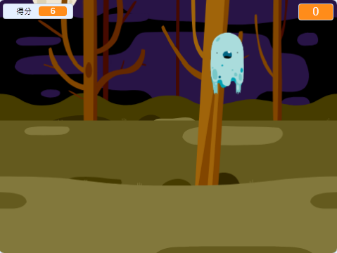

## 然後呢？

試試[捉鬼敢死隊](https://projects.raspberrypi.org/en/projects/ghostbusters?utm_source=pathway&utm_medium=whatnext&utm_campaign=projects)專案！ 你要學習怎麼做一個人抓鬼的遊戲專案。 你會學到如何在遊戲中添加計時器和記分器，這樣子就可以統計你在時間內抓到多少鬼。

--- no-print ---

  <iframe allowtransparency="true" width="485" height="402" src="https://scratch.mit.edu/projects/embed/276874679/?autostart=false" frameborder="0" scrolling="no"></iframe>
  

--- /no-print ---

--- print-only ---

--- /print-only ---

***

這個專案由以下志工翻譯：

Dnow Ba

Simon Mak

感謝志工們，我們才能為來自世界各地的人們提供學習機會。你也可以擔任翻譯志工，幫我們創造更多機會，若要進一步瞭解，請造訪 [rpf.io/translate](https://rpf.io/translate)。
